[](https://opensource.org/licenses/MIT)
[](https://codecov.io/gh/zktuong/ktplots)
[](https://github.com/zktuong/ktplots/actions/workflows/r.yml)
[](https://doi.org/10.5281/zenodo.5717922)

# ktplots
R plotting functions to plot gene expression data of single-cell data.

For a python port of `ktplots`, please check out my other [repository](https://www.github.com/zktuong/ktplotspy).

## Installation instructions
You can install the package via ```devtools::install_github()``` function in R
```R
if (!requireNamespace("devtools", quietly = TRUE))
    install.packages("devtools")
if (!requireNamespace("BiocManager", quietly = TRUE))
    install.packages("BiocManager")
devtools::install_github('zktuong/ktplots', dependencies = TRUE)
```
## Usage instructions
```R
library(ktplots)
```
There is a test dataset in `SingleCellExperiment` format to test the functions.
```R
library(SingleCellExperiment)
data(kidneyimmune)
#Some functions accept Seurat objects too.
```
The data is downsampled from the [kidney cell atlas](https://kidneycellatlas.org).

For more info, please see [Stewart et al. kidney single cell data set published in Science 2019](https://science.sciencemag.org/content/365/6460/1461).

## plot_cpdb
This function seems like it's the most popular so I moved it up! Please see below for alternative visualisation options.

Generates a dot plot after CellPhoneDB analysis via specifying the query celltypes and genes. The difference compared to the original cellphonedb `plot` is that this is totally customizable!

The plotting is largely determined by the format of the meta file provided to CellPhoneDB analysis.

To run, you will need to load in the means.txt and pvals.txt from the analysis. If you are using results from cellphonedb `deg_analysis` mode from version >= 3, the `pvalues.txt` is `relevant_interactions.txt` and also add `degs_analysis = TRUE` into all the functions below. 
```R
# pvals <- read.delim("pvalues.txt", check.names = FALSE)
# means <- read.delim("means.txt", check.names = FALSE)

# I've provided an example dataset
data(cpdb_output)
plot_cpdb(cell_type1 = 'B cell', cell_type2 = 'CD4T cell', scdata = kidneyimmune,
	idents = 'celltype', # column name where the cell ids are located in the metadata
	split.by = 'Experiment', # column name where the grouping column is. Optional.
	means = means, pvals = pvals,
	genes = c("XCR1", "CXCL10", "CCL5")) +
small_axis(fontsize = 3) + small_grid() + small_guide() + small_legend(fontsize = 2) # some helper functions included in ktplots to help with the plotting
```
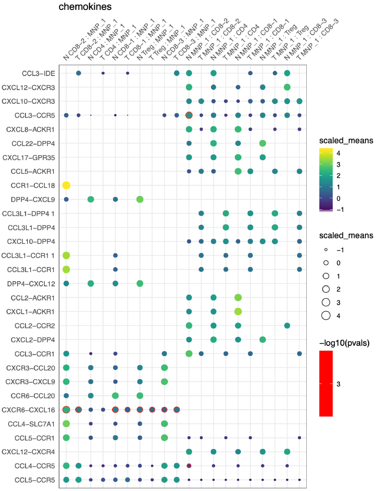

You can also try specifying ```gene.family``` option which will grep some pre-determined genes.
```R
plot_cpdb(cell_type1 = 'B cell', cell_type2 = 'CD4T cell', scdata = kidneyimmune,
    idents = 'celltype', means = means, pvals = pvals, split.by = 'Experiment',
    gene.family = 'chemokines') + small_guide() + small_axis() + small_legend(keysize=.5)
```
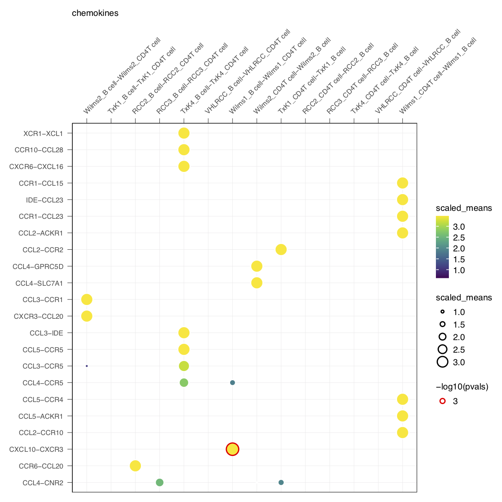
```R
plot_cpdb(cell_type1 = 'B cell', cell_type2 = 'CD4T cell', scdata = kidneyimmune,
    idents = 'celltype', means = means, pvals = pvals, split.by = 'Experiment',
    gene.family = 'chemokines', col_option = "maroon", highlight = "blue") + small_guide() + small_axis() + small_legend(keysize=.5)
```

```R
plot_cpdb(cell_type1 = 'B cell', cell_type2 = 'CD4T cell', scdata = kidneyimmune,
    idents = 'celltype', means = means, pvals = pvals, split.by = 'Experiment',
    gene.family = 'chemokines', col_option = viridis::cividis(50)) + small_guide() + small_axis() + small_legend(keysize=.5)
```
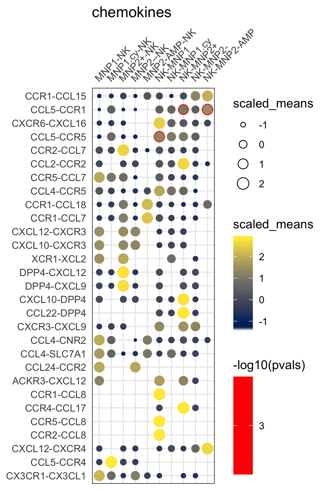
```R
plot_cpdb(cell_type1 = 'B cell', cell_type2 = 'CD4T cell', scdata = kidneyimmune,
    idents = 'celltype', means = means, pvals = pvals, split.by = 'Experiment',
    gene.family = 'chemokines', noir = TRUE) + small_guide() + small_axis() + small_legend(keysize=.5)
```
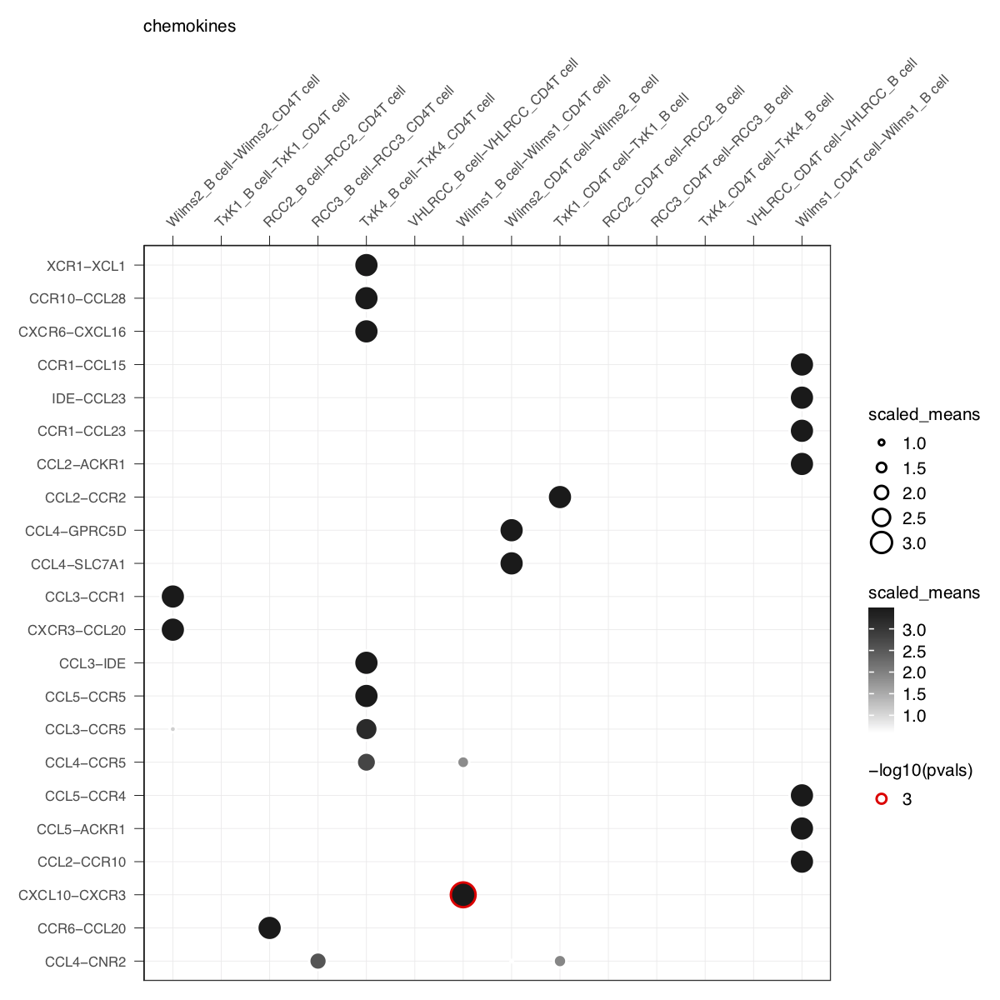

A new style to plot inspired from `squidpy.pl.ligrec` where significant interactions are shown as outline instead.
```R
plot_cpdb(cell_type1 = 'B cell', cell_type2 = 'CD4T cell', scdata = kidneyimmune,
    idents = 'celltype', means = means, pvals = pvals, split.by = 'Experiment',
    gene.family = 'chemokines', default_style = FALSE) + small_guide() + small_axis() + small_legend(keysize=.5)
```


if ```genes``` and ```gene.family``` are both not specified, the function will try to plot everything.

Specifying ```keep_significant_only``` will only keep those that are p<0.05 (which you can try to adjust with ```p.adjust.method```).

You can now also specify more than 1 gene families:
```R
p <- plot_cpdb("B cell", "CD4T cell", kidneyimmune, "celltype", means, pvals,
        split.by = "Experiment", gene.family = c("Coinhibitory", "Costimulatory"),
        cluster_rows = FALSE, # ensures that the families are separate
        keep_significant_only = TRUE)
```
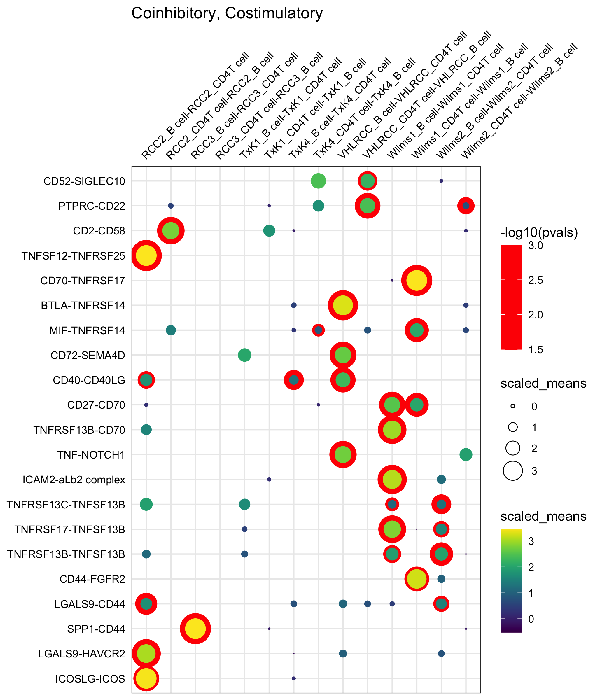

And also provide custom families as a ```data.frame```.
```R
df = data.frame(set1 = c("CCR6", "CCL20"), set2 = c("CCL5", "CCR4"))
p <- plot_cpdb("B cell", "CD4T cell", kidneyimmune, "celltype", means, pvals,
        split.by = "Experiment", gene.family = c("set1", "set2"), custom_gene_family =df,
        keep_significant_only = TRUE)
```
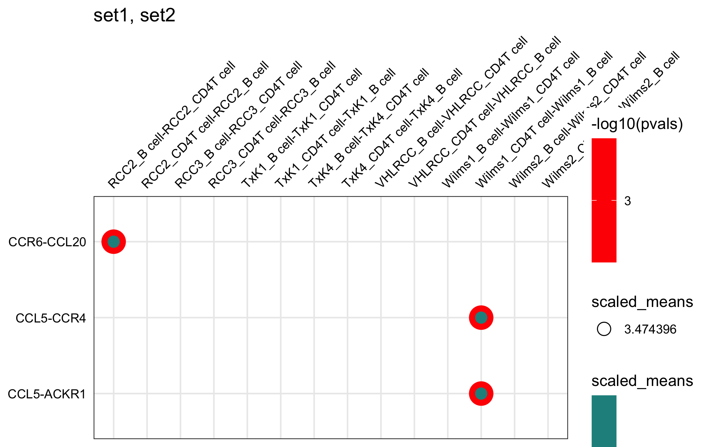

## combine_cpdb

For the ```split.by``` option to work, the annotation in the meta file must be defined in the following format:
```R
{split.by}_{idents}
```

so to set up an example vector, it would be something like:
```R
annotation <- paste0(kidneyimmune$Experiment, '_', kidneyimmune$celltype)
```

The recommended way to use `split.by` is to prepare the data with `combine_cpdb` like in this example:

```R
# Assume you have 2 cellphonedb runs, one where it's just naive and the other is treated, you will end up with 2 cellphonedb out folders
# remember, the celltype labels you provide to cellphonedb's meta.txt should already be like {split.by}_{idents}
# so the two meta.txt should look like:

# naive file
# ATTAGTCGATCGTAGT-1    naive_CD4Tcell
# ATTAGTGGATCGTAGT-1    naive_CD4Tcell
# ATTAGTCGACCGTAGT-1    naive_CD8Tcell
# ATTAGTCGATCGTAGT-1    naive_CD8Tcell
# ATGAGTCGATCGTAGT-1    naive_Bcell
# ATTAGTCGATCGTGGT-1    naive_Bcell

# treated file
# ATTAGTCAATCGTAGT-1    treated_CD4Tcell
# ATTAGTGGATCGTAGT-1    treated_CD4Tcell
# ATTAGTCGACCATAGT-1    treated_CD8Tcell
# ATTAGTAGATCGTAGT-1    treated_CD8Tcell
# ATGAGTCGATCGTAAT-1    treated_Bcell
# ATTAGTCGATCGTGAT-1    treated_Bcell

# one you have set that up correctly, you can then read in the files.
naive_means <- read.delim("naive_out/means.txt", check.names = FALSE)
naive_pvals <- read.delim("naive_out/pvalues.txt", check.names = FALSE)
naive_decon <- read.delim("naive_out/deconvoluted.txt", check.names = FALSE)

treated_means <- read.delim("treated_out/means.txt", check.names = FALSE)
treated_pvals <- read.delim("treated_out/pvalues.txt", check.names = FALSE)
treated_decon <- read.delim("treated_out/deconvoluted.txt", check.names = FALSE)

means <- combine_cpdb(naive_means, treated_means)
pvals <- combine_cpdb(naive_pvals, treated_pvals)
decon <- combine_cpdb(naive_decon, treated_decon)

plot_cpdb(...)
```

## plot_cpdb2
Generates a circos-style wire/arc/chord plot for cellphonedb results.

This function piggy-backs on the original `plot_cpdb` function and generates the results like this:

Please help contribute to the interaction grouping list [here](https://docs.google.com/spreadsheets/d/1O9OKU7J0NdeQNJAIMpsHtWAFvY014GDQ7aigdGUSTmc/edit?usp=sharing)!

Credits to Ben Stewart for coming up with the base code!

#### Simple usage with example data
```R
library(ktplots)
data(kidneyimmune)
data(cpdb_output2)

p <- plot_cpdb2(cell_type1 = 'B cell', cell_type2 = 'CD4T cell',
    scdata = kidneyimmune,
    idents = 'celltype', # column name where the cell ids are located in the metadata
    means = means2,
    pvals = pvals2,
    deconvoluted = decon2, # new options from here on specific to plot_cpdb2
    desiredInteractions = list(
        c('CD4T cell', 'B cell'),
        c('B cell', 'CD4T cell')),
    interaction_grouping = interaction_annotation,
    edge_group_colors = c(
        "Activating" = "#e15759",
        "Chemotaxis" = "#59a14f",
        "Inhibitory" = "#4e79a7",
        "Intracellular trafficking" = "#9c755f",
        "DC_development" = "#B07aa1",
        "Unknown" = "#e7e7e7"
        ),
    node_group_colors = c(
        "CD4T cell" = "red",
        "B cell" = "blue"),
    keep_significant_only = TRUE,
    standard_scale = TRUE,
    remove_self = TRUE
    )
p
```
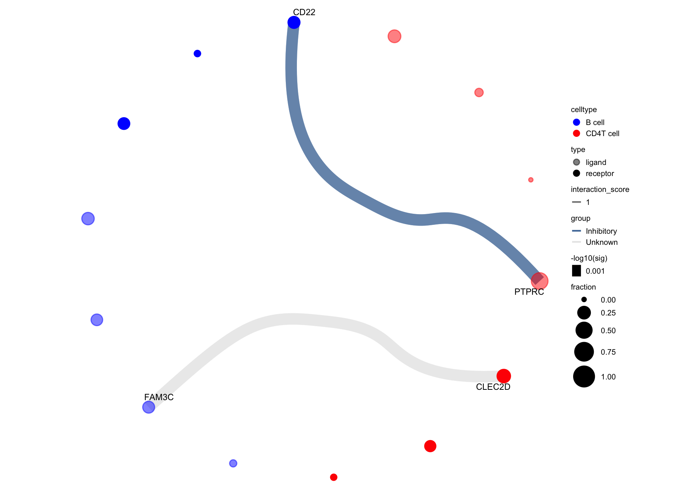

#### Formatting data from anndata formatted file
```R
# code example but not using the example datasets
library(SingleCellExperiment)
library(reticulate)
library(ktplots)
ad=import('anndata')

adata = ad$read_h5ad('rna.h5ad')
counts <- Matrix::t(adata$X)
row.names(counts) <- row.names(adata$var)
colnames(counts) <- row.names(adata$obs)
sce <- SingleCellExperiment(list(counts = counts), colData = adata$obs, rowData = adata$var)

means <- read.delim('out/means.txt', check.names = FALSE)
pvalues <- read.delim('out/pvalues.txt', check.names = FALSE)
deconvoluted <- read.delim('out/deconvoluted.txt', check.names = FALSE)
interaction_grouping <- read.delim('interactions_groups.txt')
# > head(interaction_grouping)
#     interaction       role
# 1 ALOX5_ALOX5AP Activating
# 2    ANXA1_FPR1 Inhibitory
# 3 BTLA_TNFRSF14 Inhibitory
# 4     CCL5_CCR5 Chemotaxis
# 5      CD2_CD58 Activating
# 6     CD28_CD86 Activating

test <- plot_cpdb2(cell_type1 = "CD4_Tem|CD4_Tcm|CD4_Treg", # same usage style as plot_cpdb
	cell_type2 = "cDC",
	idents = 'fine_clustering',
	split.by = 'treatment_group_1',
	scdata = sce,
	means = means,
	pvals = pvalues,
	deconvoluted = deconvoluted, # new options from here on specific to plot_cpdb2
	gene_symbol_mapping = 'index', # column name in rowData holding the actual gene symbols if the row names is ENSG Ids. Might be a bit buggy
	desiredInteractions = list(c('CD4_Tcm', 'cDC1'), c('CD4_Tcm', 'cDC2'), c('CD4_Tem', 'cDC1'), c('CD4_Tem', 'cDC2	'), c('CD4_Treg', 'cDC1'), c('CD4_Treg', 'cDC2')),
	interaction_grouping = interaction_grouping,
    edge_group_colors = c("Activating" = "#e15759", "Chemotaxis" = "#59a14f", "Inhibitory" = "#4e79a7", "   Intracellular trafficking" = "#9c755f", "DC_development" = "#B07aa1"),
    node_group_colors = c("CD4_Tcm" = "#86bc86", "CD4_Tem" = "#79706e", "CD4_Treg" = "#ff7f0e", "cDC1" = "#bcbd22"  ,"cDC2" = "#17becf"),
    keep_significant_only = TRUE,
    standard_scale = TRUE,
    remove_self = TRUE)
```
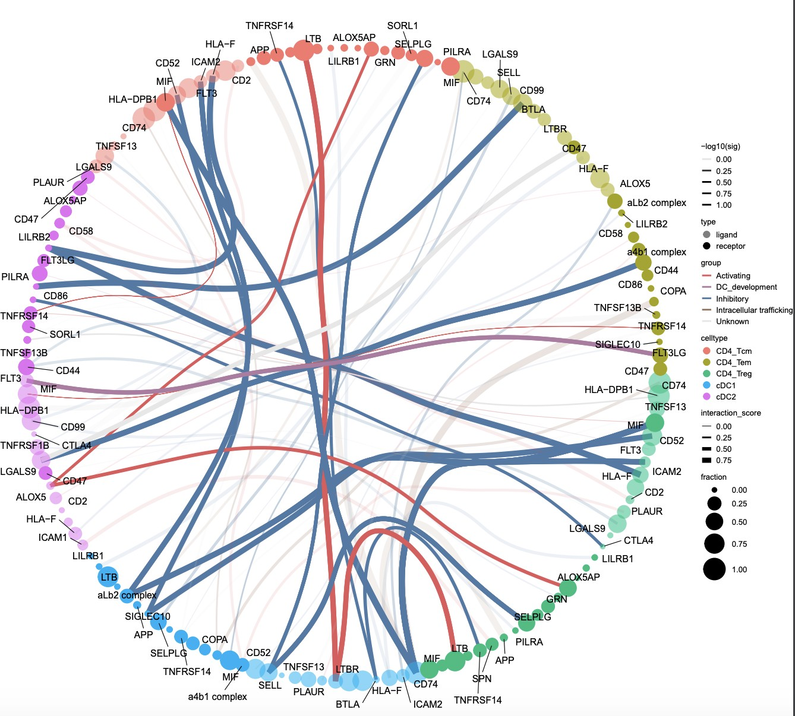

## plot_cpdb3
Generates a chord diagram inspired from [CellChat](https://github.com/sqjin/CellChat)'s way of showing the data!

Usage is similar to `plot_cpdb2` but with reduced options. Additional kwargs are passed to `plot_cpdb`.
```R
library(ktplots)
data(kidneyimmune)
data(cpdb_output2)

p <- plot_cpdb3(cell_type1 = 'B cell', cell_type2 = 'CD4T cell|MNPd',
    scdata = kidneyimmune,
    idents = 'celltype', # column name where the cell ids are located in the metadata
    means = means2,
    pvals = pvals2,
    deconvoluted = decon2, # new options from here on specific to plot_cpdb3
    keep_significant_only = TRUE,
    standard_scale = TRUE,
    remove_self = TRUE
    )
p
```

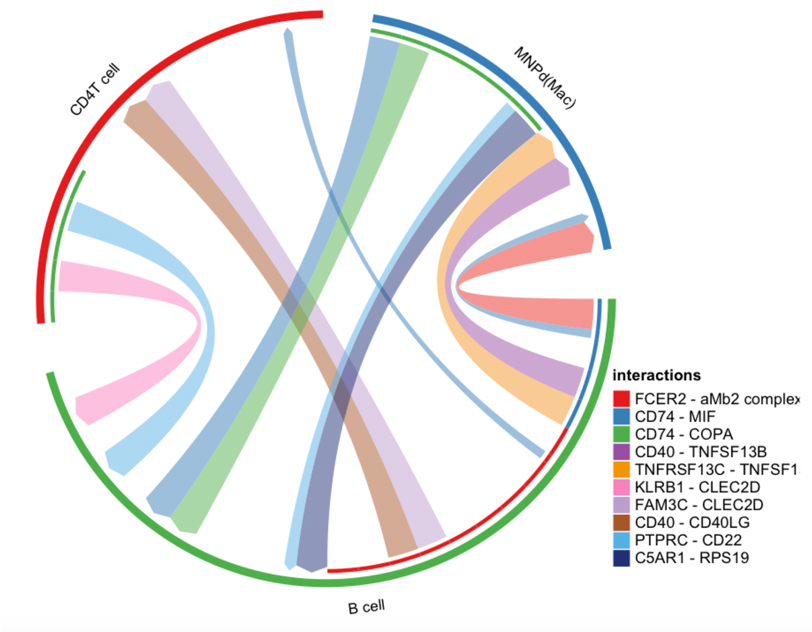


## plot_cpdb4
New! Alternate way of showing the chord diagram for specific interactions!

Usage is similar to `plot_cpdb3` but with additional required `interaction` option. Additional kwargs are passed to `plot_cpdb`.
```R
library(ktplots)
data(kidneyimmune)
data(cpdb_output2)

p <- plot_cpdb4(
    interaction = 'CLEC2D-KLRB1',
    cell_type1 = 'NK', cell_type2 = 'Mast',
    scdata = kidneyimmune,
    idents = 'celltype',
    means = means2,
    pvals = pvals2,
    deconvoluted = decon2,
    keep_significant_only = TRUE,
    standard_scale = TRUE,
    )
p
```

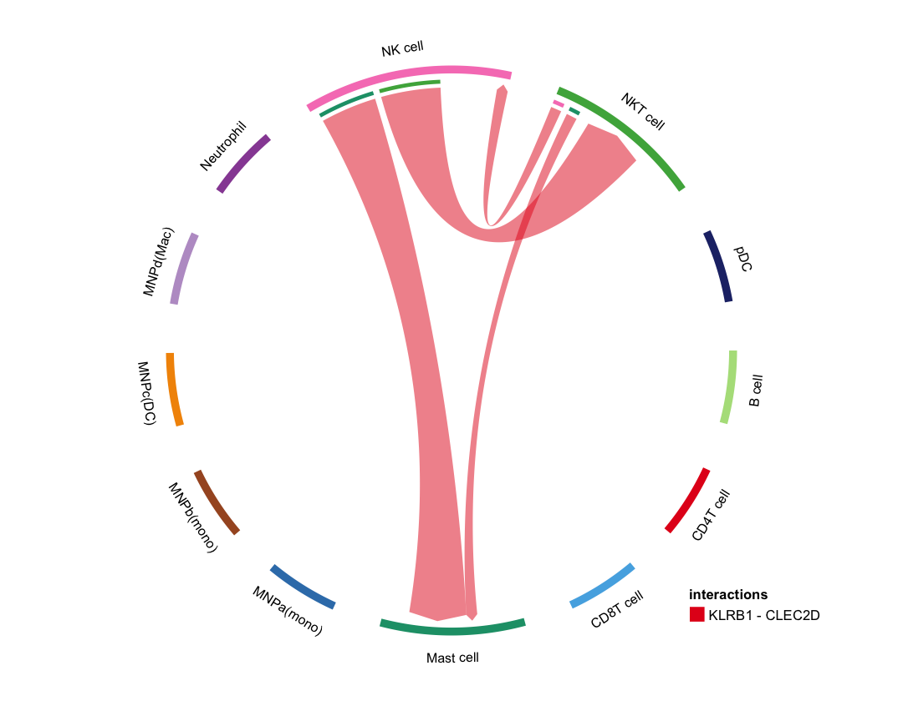

or specify more than 1 interactions + only show specific cell-type type interactions!
```R
plot_cpdb4(
        interaction = c('CLEC2D-KLRB1', 'CD40-CD40LG'),
        cell_type1 = 'NK|B', cell_type2 = 'Mast|CD4T',
        scdata = kidneyimmune,
        idents = 'celltype',
        means = means2,
        pvals = pvals2,
        deconvoluted = decon2,
        desiredInteractions = list(
            c('NK cell', 'Mast cell'),
            c('NK cell', 'NKT cell'),
            c('NKT cell', 'Mast cell'),
            c('B cell', 'CD4T cell')),
        keep_significant_only = TRUE,
        )
```

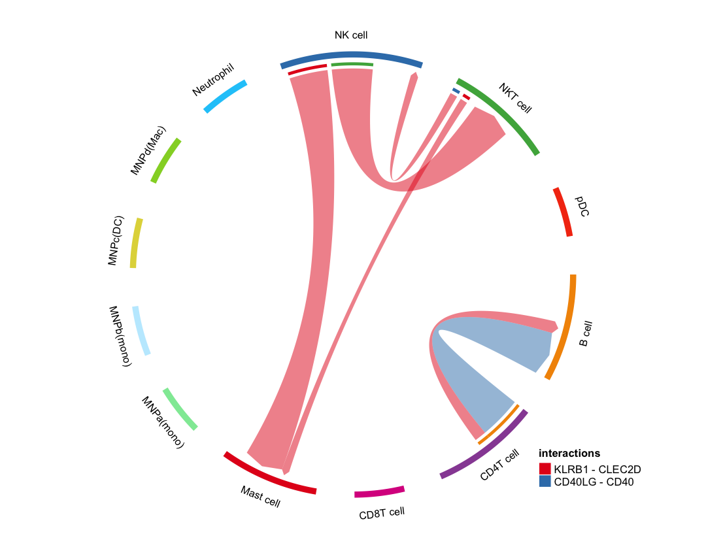


## plot_cpdb_heatmap

New! Ported the original heatmap plot to this pacakge as per the main cellphonedb repo. Uses `pheatmap` internally. Colours indicate the number of significant interactions.

```R
plot_cpdb_heatmap(kidneyimmune, 'celltype', pvals2, cellheight = 10, cellwidth = 10)
```

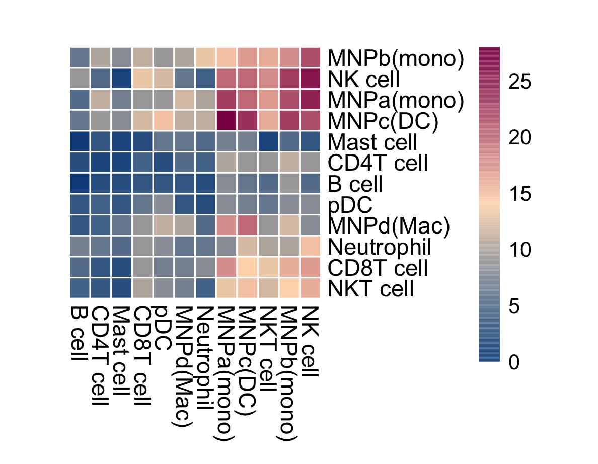


## Other useful functions

## geneDotPlot
Plotting gene expression dot plots heatmaps.
```R
# Note, this conflicts with tidyr devel version
geneDotPlot(scdata = kidneyimmune, # object
    genes = c("CD68", "CD80", "CD86", "CD74", "CD2", "CD5"), # genes to plot
    idents = "celltype", # column name in meta data that holds the cell-cluster ID/assignment
    split.by = 'Project', # column name in the meta data that you want to split the plotting by. If not provided, it will just plot according to idents
    standard_scale = TRUE) + # whether to scale expression values from 0 to 1. See ?geneDotPlot for other options
theme(strip.text.x = element_text(angle=0, hjust = 0, size =7)) + small_guide() + small_legend()
```
Hopefully you end up with something like this:
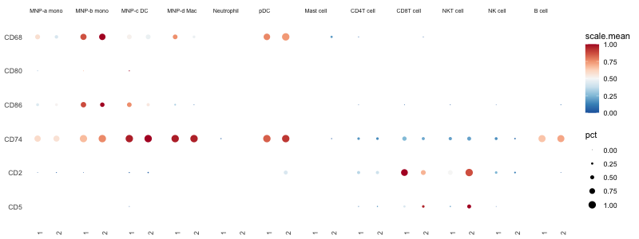


## correlationSpot
Ever wanted to ask if your gene(s) and/or prediction(s) of interests correlate spatially in vissium data? Now you can!
**disclaimer** It might be buggy.
```R
library(ggplot2)
scRNAseq <- Seurat::SCTransform(scRNAseq, verbose = FALSE) %>% Seurat::RunPCA(., verbose = FALSE) %>% Seurat::RunUMAP(., dims = 1:30, verbose = FALSE)
anchors <- Seurat::FindTransferAnchors(reference = scRNAseq, query = spatial, normalization.method = "SCT")
predictions.assay <- Seurat::TransferData(anchorset = anchors, refdata = scRNAseq$label, dims = 1:30, prediction.assay = TRUE, weight.reduction = spatial[["pca"]])
spatial[["predictions"]] <- predictions.assay
Seurat::DefaultAssay(spatial) <- "predictions"
Seurat::DefaultAssay(spatial) <- 'SCT'
pa <- Seurat::SpatialFeaturePlot(spatial, features = c('Tnfsf13b', 'Cd79a'), pt.size.factor = 1.6, ncol = 2, crop = TRUE) + viridis::scale_fill_viridis()
Seurat::DefaultAssay(spatial) <- 'predictions'
pb <- Seurat::SpatialFeaturePlot(spatial, features = 'Group1-3', pt.size.factor = 1.6, ncol = 2, crop = TRUE) + viridis::scale_fill_viridis()

p1 <- correlationSpot(spatial, genes = c('Tnfsf13b', 'Cd79a'), celltypes = 'Group1-3', pt.size.factor = 1.6, ncol = 2, crop = TRUE) + scale_fill_gradientn( colors = rev(RColorBrewer::brewer.pal(12, 'Spectral')),limits = c(-1, 1))
p2 <- correlationSpot(spatial, genes = c('Tnfsf13b', 'Cd79a'), celltypes = 'Group1-3', pt.size.factor = 1.6, ncol = 2, crop = TRUE, average_by_cluster = TRUE) + scale_fill_gradientn(colors = rev(RColorBrewer::brewer.pal(12, 'Spectral')),limits = c(-1, 1)) + ggtitle('correlation averaged across clusters')

cowplot::plot_grid(pa, pb, p1, p2, ncol = 2)
```
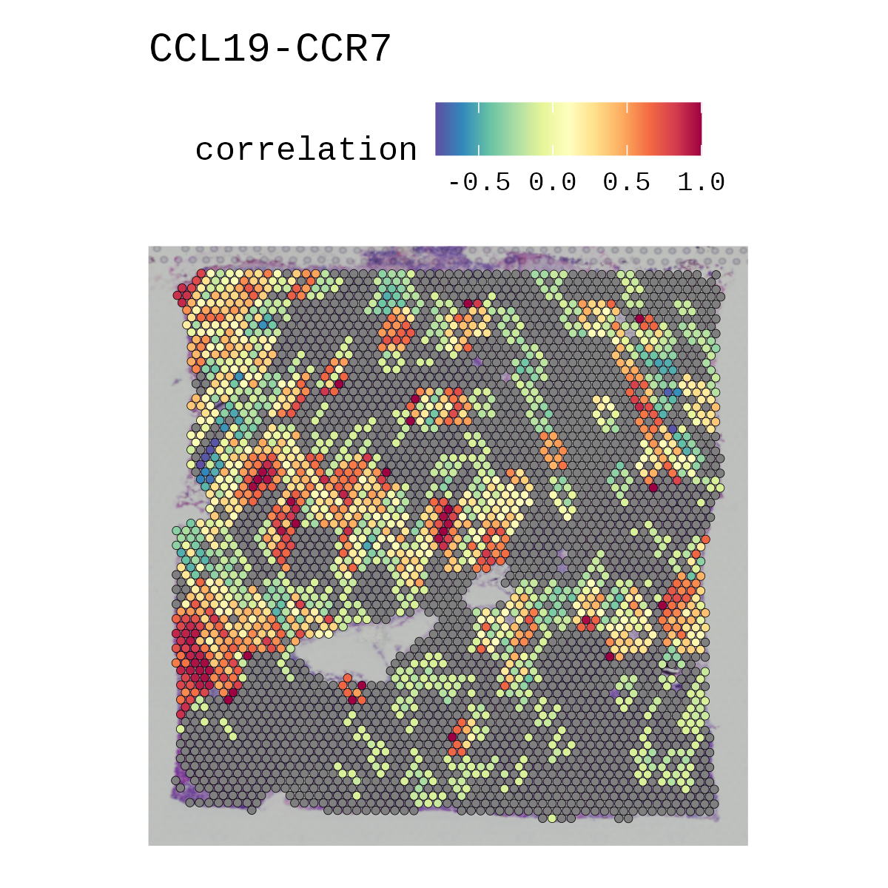


## small_legend/small_guide/small_axis/small_grid/topright_legend/topleft_legend/bottomleft_legend/bottomright_legend
As shown in the examples above, these are some functions to quickly adjust the size and position of ggplots.
```R
# for example
g <- Seurat::DimPlot(kidneyimmune, group.by = "celltype")
g1 <- g + small_legend() + small_guide() + small_axis() + bottomleft_legend()
library(patchwork)
g + g1
```
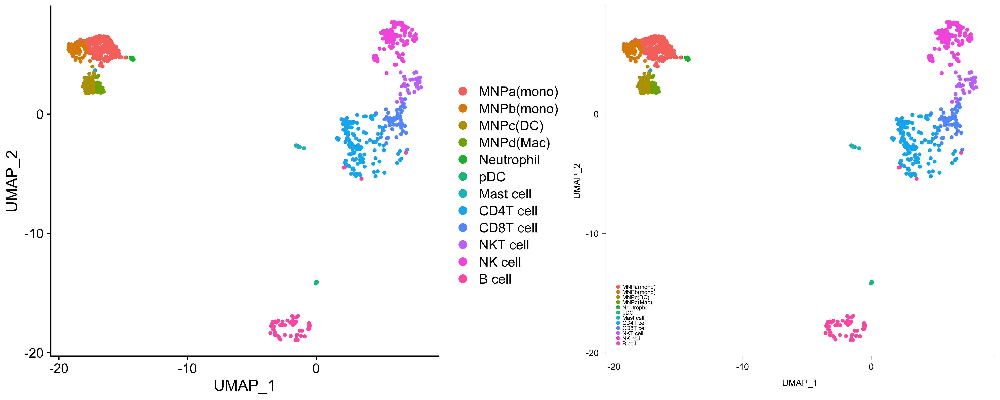


## Citation
If you find these functions useful, please consider leaving a star, citing this repository, and/or citing the following [DOI](https://doi.org/10.5281/zenodo.5717922):

To cite a specific version of `ktplots`, please follow the links on the zenodo repository. e.g. v1.2.3:
```
Zewen Kelvin Tuong. (2021). zktuong/ktplots: 1.2.3 (v1.2.3). Zenodo. https://doi.org/10.5281/zenodo.5717922
```

Thank you!
