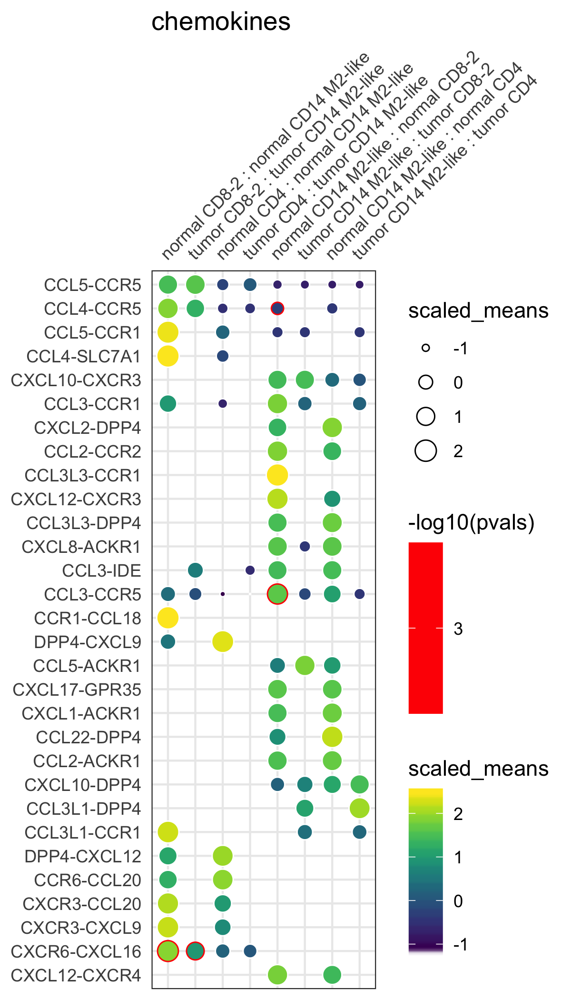
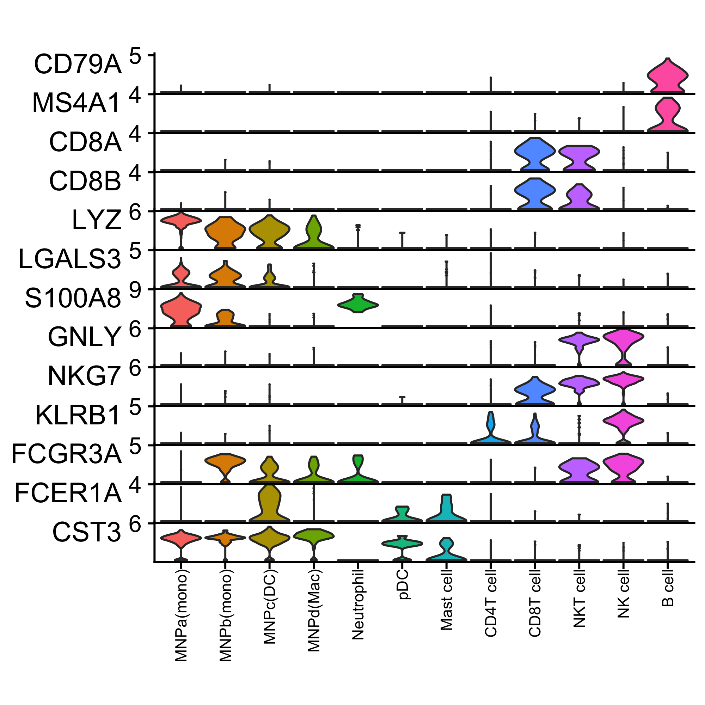
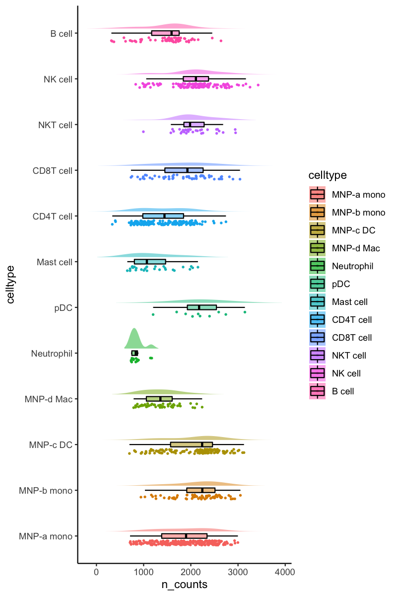

[](https://opensource.org/licenses/MIT)
[](https://codecov.io/gh/zktuong/ktplots)
[](https://travis-ci.com/zktuong/ktplots)
# ktplots
R plotting functions to plot gene expression data of single-cell data.


## Installation instructions
You can install the package via ```devtools::install_github()``` function in R
```R
if (!requireNamespace("devtools", quietly = TRUE))
    install.packages("devtools")
if (!requireNamespace("BiocManager", quietly = TRUE))
    install.packages("BiocManager")
devtools::install_github('zktuong/ktplots', dependencies = TRUE)
```
## Usage instructions
```R
library(ktplots)
```
There is a test dataset for most of these functions that can be loaded via
```R
# note, you need to load Seurat to interact with it
# library(Seurat)
data(kidneyimmune)
```
It is a seurat object which i downsampled from the [kidney cell atlas](https://kidneycellatlas.org). For more info, please see [Stewart et al. kidney single cell data set published in Science 2019](https://science.sciencemag.org/content/365/6460/1461).

### geneDotPlot
plotting gene expression dot plots heatmaps
```R
# Note, this conflicts with tidyr devel version
geneDotPlot(scdata = kidneyimmune, # object 
	genes = c("CD68", "CD80", "CD86", "CD74", "CD2", "CD5"), # genes to plot
	idents = "celltype", # column name in meta data that holds the cell-cluster ID/assignment
	split.by = 'Project', # column name in the meta data that you want to split the plotting by. If not provided, it will just plot according to idents
	standard_scale = TRUE) + # whether to scale expression values from 0 to 1. See ?geneDotPlot for other options
theme(strip.text.x = element_text(angle=0, hjust = 0, size =7))

```
hopefully you end up with something like this


### plot_cpdb
Generates the dot plot for cpdb output via specifying the cell types and the genes
```R
# I'm in the process of setting up some example data so it can be more reproducible realistic examples
pvals <- read.delim("pvalues.txt", check.names = FALSE) # pvalues.txt and means.txt are output from cpdb
means <- read.delim("means.txt", check.names = FALSE) 
plot_cpdb(cell_type1 = "Bcell", # cell_type1 and cell_type2 will call grep, so this will accept regex arguments. Additional options for grep can be specified, such as fixed = TRUE to stop grep from misinterpreting/converting symbols.
	cell_type2 = "Tcell",
	seurat_object,
	"clusternames", # column name where the cell ids are located in the metadata
	means,
	pvals,
	split.by = "group", # column name where the grouping column is
	genes = c("CXCR3", "CD274", "CXCR5"))
```

```R
plot_cpdb("NK", "MNP", scdata, "final.labels", means, pvals, genes = c("CXCR3", "CD274", "CXCR5")) + 
	guides(shape = guide_legend(override.aes = list(size = 4)), color = guide_legend(override.aes = list(size = 4))) +
	theme(legend.title = element_text(size = 4), legend.text = element_text(size = 4), legend.key.size = unit(0.5, "lines"))
```


or, you can try by a crude grep via the 'gene.family'
```R
plot_cpdb(cell_type1 = "Bcell",
	cell_type2 = "Tcell",
	means,
	seurat_object,
	"clusternames",
	pvals,
	split.by = "group",
	gene.family = "chemokines") # can also try Th1, Th2, Th17, Treg, costimulatory, coinhibitory, niche
```
if ```genes``` and ```gene.family``` are both not specified, by default it will plot everything.
Specifying ```keep_significant_only``` will only keep those that are p<0.05 (with or without adjustment via ```p.adjust.method```).

some examples
```R
plot_cpdb("NK", "MNP", scdata, "final.labels", means, pvals, gene.family = "chemokines")
```

```R
plot_cpdb("NK", "MNP", scdata, "final.labels", means, pvals, gene.family = "chemokines", col_option = "maroon", highlight = "blue")
```

```R
plot_cpdb("NK", "MNP", scdata, "final.labels", means, pvals, gene.family = "chemokines", col_option = viridis::cividis(50))
```

```R
plot_cpdb("NK", "MNP", scdata, "final.labels", means, pvals, gene.family = "chemokines", noir = TRUE)
```


```R
# when there's two groups in your input table to cpdb
p <- plot_cpdb("MNP_1", "Lymphoid_[12]", px.cpdb, "Combined.labels", means, pvals, gene.family = "chemokines", split.by = "group")
newLabels <- gsub("Lymphoid_[12]|MNP_1","",levels(p$data$Var2))
newLabels <- gsub("__"," ",newLabels) 
newLabels <- gsub("*-t"," : t",newLabels) 
newLabels <- gsub("*-n"," : n",newLabels) 
p + scale_x_discrete(breaks=levels(p$data$Var2), labels=newLabels, position = "top")
```


### StackedVlnPlot
Generates a stacked violinplot like in scanpy's ```sc.pl.stacked_violin```. Credits to [@tangming2005](https://twitter.com/tangming2005)
```R
features <- c("CD79A", "MS4A1", "CD8A", "CD8B", "LYZ", "LGALS3", "S100A8", "GNLY", "NKG7", "KLRB1", "FCGR3A", "FCER1A", "CST3")
StackedVlnPlot(kidneyimmune, features = features) + ggplot2::theme(axis.text.x = ggplot2::element_text(angle = 90, hjust = 1, size = 8))
```


### rainCloudPlot
generates a raincloudplot to use boxplot, scatterplot and violin all at once!
kudos to [https://wellcomeopenresearch.org/articles/4-63](https://wellcomeopenresearch.org/articles/4-63)
```R
rainCloudPlot(data = kidneyimmune@meta.data, groupby = "celltype", parameter = "n_counts") + coord_flip()
```


### small_legend/small_guide/small_axis/topright_legend/topleft_legend/bottomleft_legend/bottomright_legend
ever wanted to quickly adjust the size and position of ggplots? now you can with these helper functions that you can tag on!
```R
# for example
g <- Seurat::DimPlot(kidneyimmune, color = "celltype")
g1 <- g + small_legend() + small_guide() + small_axis() + bottomleft_legend() 
library(patchwork)
g + g1
```
