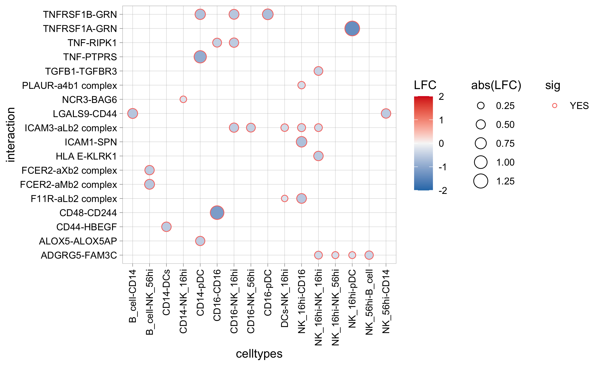
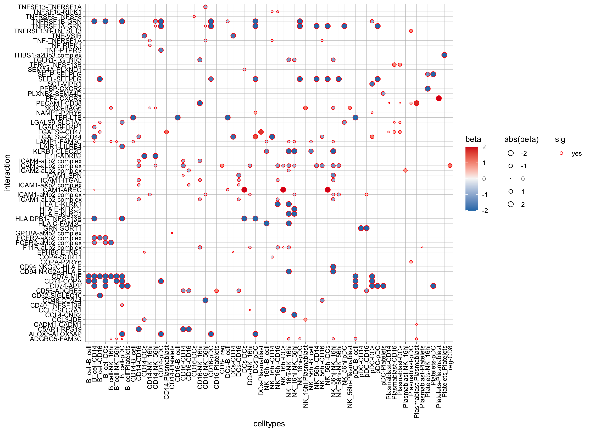
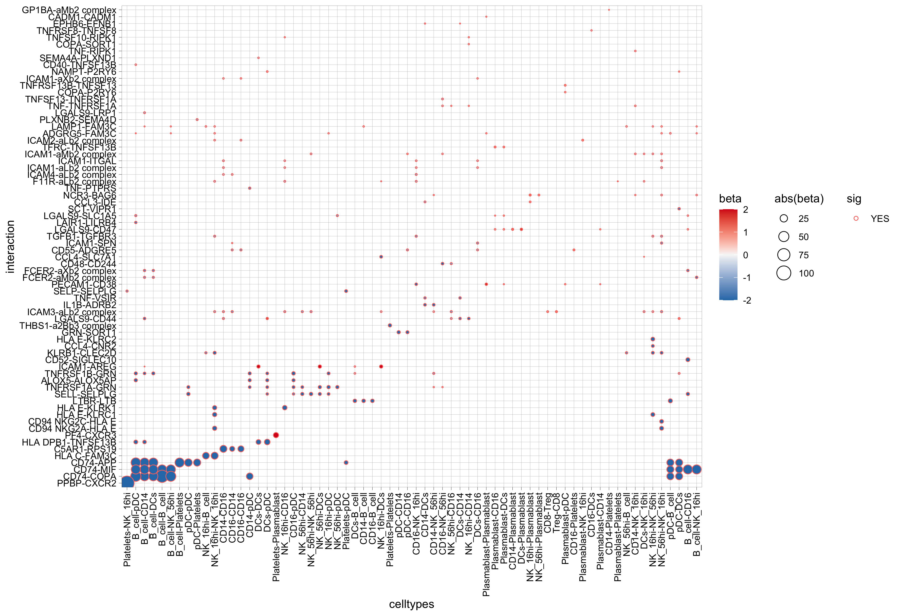

[](https://opensource.org/licenses/MIT)
[](https://codecov.io/gh/zktuong/ktplots)
[](https://github.com/zktuong/ktplots/actions/workflows/r.yml)
[](https://doi.org/10.5281/zenodo.5717923)

# ktplots
R plotting functions to plot gene expression data of single-cell data.


## Installation instructions
You can install the package via ```devtools::install_github()``` function in R
```R
if (!requireNamespace("devtools", quietly = TRUE))
    install.packages("devtools")
if (!requireNamespace("BiocManager", quietly = TRUE))
    install.packages("BiocManager")
devtools::install_github('zktuong/ktplots', dependencies = TRUE)
```
## Usage instructions
```R
library(ktplots)
```
There is a test dataset in Seurat format to test the functions.
```R
# note, you need to load Seurat to interact with it
# so maybe install Seurat if you haven't already
# if (!requireNamespace("Seurat", quietly = TRUE))
    # install.packages("Seurat")
library(Seurat)
data(kidneyimmune)
```
The data is downsampled from the [kidney cell atlas](https://kidneycellatlas.org).

For more info, please see [Stewart et al. kidney single cell data set published in Science 2019](https://science.sciencemag.org/content/365/6460/1461).

### geneDotPlot
Plotting gene expression dot plots heatmaps.
```R
# Note, this conflicts with tidyr devel version
geneDotPlot(scdata = kidneyimmune, # object
	genes = c("CD68", "CD80", "CD86", "CD74", "CD2", "CD5"), # genes to plot
	idents = "celltype", # column name in meta data that holds the cell-cluster ID/assignment
	split.by = 'Project', # column name in the meta data that you want to split the plotting by. If not provided, it will just plot according to idents
	standard_scale = TRUE) + # whether to scale expression values from 0 to 1. See ?geneDotPlot for other options
theme(strip.text.x = element_text(angle=0, hjust = 0, size =7)) + small_guide() + small_legend()
```
Hopefully you end up with something like this:


### plot_cpdb
Generates a dot plot after CellPhoneDB analysis via specifying the query celltypes and genes.

The plotting is largely determined by the format of the meta file provided to CellPhoneDB analysis.

For the ```split.by``` option to work, the annotation in the meta file must be defined in the following format:
```R
{split.by}_{idents}
```

so to set up an example vector, it would be something like:
```R
annotation <- paste0(kidneyimmune$Experiment, '_', kidneyimmune$celltype)
```

To run, you will need to load in the means.txt and pvals.txt from the analysis.
```R
# pvals <- read.delim("pvalues.txt", check.names = FALSE)
# means <- read.delim("means.txt", check.names = FALSE)

# I've provided an example dataset
data(cpdb_output)
plot_cpdb(cell_type1 = 'B cell', cell_type2 = 'CD4T cell', scdata = kidneyimmune,
	idents = 'celltype', # column name where the cell ids are located in the metadata
	split.by = 'Experiment', # column name where the grouping column is. Optional.
	means = means, pvals = pvals,
	genes = c("XCR1", "CXCL10", "CCL5")) +
small_axis(fontsize = 3) + small_grid() + small_guide() + small_legend(fontsize = 2) # some helper functions included in ktplots to help with the plotting
```


You can also try specifying ```gene.family``` option which will grep some pre-determined genes.
```R
plot_cpdb(cell_type1 = 'B cell', cell_type2 = 'CD4T cell', scdata = kidneyimmune,
	idents = 'celltype', means = means, pvals = pvals, split.by = 'Experiment',
	gene.family = 'chemokines') + small_guide() + small_axis() + small_legend(keysize=.5)
```

```R
plot_cpdb(cell_type1 = 'B cell', cell_type2 = 'CD4T cell', scdata = kidneyimmune,
	idents = 'celltype', means = means, pvals = pvals, split.by = 'Experiment',
	gene.family = 'chemokines', col_option = "maroon", highlight = "blue") + small_guide() + small_axis() + small_legend(keysize=.5)
```

```R
plot_cpdb(cell_type1 = 'B cell', cell_type2 = 'CD4T cell', scdata = kidneyimmune,
	idents = 'celltype', means = means, pvals = pvals, split.by = 'Experiment',
	gene.family = 'chemokines', col_option = viridis::cividis(50)) + small_guide() + small_axis() + small_legend(keysize=.5)
```

```R
plot_cpdb(cell_type1 = 'B cell', cell_type2 = 'CD4T cell', scdata = kidneyimmune,
	idents = 'celltype', means = means, pvals = pvals, split.by = 'Experiment',
	gene.family = 'chemokines', noir = TRUE) + small_guide() + small_axis() + small_legend(keysize=.5)
```


A new style to plot inspired from `squidpy.pl.ligrec` where significant interactions are shown as outline instead.
```R
plot_cpdb(cell_type1 = 'B cell', cell_type2 = 'CD4T cell', scdata = kidneyimmune,
	idents = 'celltype', means = means, pvals = pvals, split.by = 'Experiment',
	gene.family = 'chemokines', default_style = FALSE) + small_guide() + small_axis() + small_legend(keysize=.5)
```


if ```genes``` and ```gene.family``` are both not specified, the function will try to plot everything.

Specifying ```keep_significant_only``` will only keep those that are p<0.05 (which you can try to adjust with ```p.adjust.method```).

### plot_cpdb2
Generates a circos-style wire/arc/chord plot for cellphonedb results.

This function piggy-backs on the original `plot_cpdb` function and generates the results like this:

Please help contribute to the interaction grouping list [here](https://docs.google.com/spreadsheets/d/1O9OKU7J0NdeQNJAIMpsHtWAFvY014GDQ7aigdGUSTmc/edit?usp=sharing)!

Credits to Ben Stewart for coming up with the base code!

#### Simple usage with example data
```R
library(ktplots)
data(kidneyimmune)
data(cpdb_output2)

sce <- Seurat::as.SingleCellExperiment(kidneyimmune)
p <- plot_cpdb2(cell_type1 = 'B cell', cell_type2 = 'CD4T cell',
    scdata = sce,
    idents = 'celltype', # column name where the cell ids are located in the metadata
    means = means2,
    pvals = pvals2,
    deconvoluted = decon2, # new options from here on specific to plot_cpdb2
    desiredInteractions = list(
        c('CD4T cell', 'B cell'),
        c('B cell', 'CD4T cell')),
    interaction_grouping = interaction_annotation,
    edge_group_colors = c(
        "Activating" = "#e15759",
        "Chemotaxis" = "#59a14f",
        "Inhibitory" = "#4e79a7",
        "Intracellular trafficking" = "#9c755f",
        "DC_development" = "#B07aa1",
        "Unknown" = "#e7e7e7"
        ),
    node_group_colors = c(
        "CD4T cell" = "red",
        "B cell" = "blue"),
    keep_significant_only = TRUE,
    standard_scale = TRUE,
    remove_self = TRUE
    )
p
```


#### Formatting data from anndata formatted file
```R
# code example but not using the example datasets
library(SingleCellExperiment)
library(reticulate)
library(ktplots)
ad=import('anndata')

adata = ad$read_h5ad('rna.h5ad')
counts <- Matrix::t(adata$X)
row.names(counts) <- row.names(adata$var)
colnames(counts) <- row.names(adata$obs)
sce <- SingleCellExperiment(list(counts = counts), colData = adata$obs, rowData = adata$var)

means <- read.delim('out/means.txt', check.names = FALSE)
pvalues <- read.delim('out/pvalues.txt', check.names = FALSE)
deconvoluted <- read.delim('out/deconvoluted.txt', check.names = FALSE)
interaction_grouping <- read.delim('interactions_groups.txt')
# > head(interaction_grouping)
#     interaction       role
# 1 ALOX5_ALOX5AP Activating
# 2    ANXA1_FPR1 Inhibitory
# 3 BTLA_TNFRSF14 Inhibitory
# 4     CCL5_CCR5 Chemotaxis
# 5      CD2_CD58 Activating
# 6     CD28_CD86 Activating

test <- plot_cpdb2(cell_type1 = "CD4_Tem|CD4_Tcm|CD4_Treg", # same usage style as plot_cpdb
	cell_type2 = "cDC",
	idents = 'fine_clustering',
	split.by = 'treatment_group_1',
	scdata = sce,
	means = means,
	pvals = pvalues,
	deconvoluted = deconvoluted, # new options from here on specific to plot_cpdb2
	gene_symbol_mapping = 'index', # column name in rowData holding the actual gene symbols if the row names is ENSG Ids. Might be a bit buggy
	desiredInteractions = list(c('CD4_Tcm', 'cDC1'), c('CD4_Tcm', 'cDC2'), c('CD4_Tem', 'cDC1'), c('CD4_Tem', 'cDC2	'), c('CD4_Treg', 'cDC1'), c('CD4_Treg', 'cDC2')),
	interaction_grouping = interaction_grouping,
    edge_group_colors = c("Activating" = "#e15759", "Chemotaxis" = "#59a14f", "Inhibitory" = "#4e79a7", "   Intracellular trafficking" = "#9c755f", "DC_development" = "#B07aa1"),
    node_group_colors = c("CD4_Tcm" = "#86bc86", "CD4_Tem" = "#79706e", "CD4_Treg" = "#ff7f0e", "cDC1" = "#bcbd22"  ,"cDC2" = "#17becf"),
    keep_significant_only = TRUE,
    standard_scale = TRUE,
    remove_self = TRUE)
```


## New feature

### compare_cpdb/plot_compare_cpdb
These functions piggy-back on the original `plot_cpdb` function and generates the results from cellphonedb that are run separately on replicates. The goal of this function is to able to compare interactions between groups.

I've provided example datasets from randomnly selected `Healthy` and `Severe` samples from [Stephenson et al. COVID-19 single cell data set published in Nature Medicine 2021](https://www.nature.com/articles/s41591-021-01329-2). This should get it running and for you to see how the input data folder should be organised:
```R
data(covid_sample_metadata)
data(covid_cpdb_meta)
file <- system.file("extdata", "covid_cpdb.tar.gz", package = "ktplots")
# copy and unpack wherever you want this to end up
file.copy(file, ".")
system("tar -xzf covid_cpdb.tar.gz")
```

It requires 1) an input table like so:
```R
> covid_cpdb_meta
     sample_id         cellphonedb_folder                       sce_file
1    MH9143325   covid_cpdb/MH9143325/out   covid_cpdb/MH9143325/sce.rds
2    MH9143320   covid_cpdb/MH9143320/out   covid_cpdb/MH9143320/sce.rds
3    MH9143274   covid_cpdb/MH9143274/out   covid_cpdb/MH9143274/sce.rds
4    MH8919226   covid_cpdb/MH8919226/out   covid_cpdb/MH8919226/sce.rds
5    MH8919227   covid_cpdb/MH8919227/out   covid_cpdb/MH8919227/sce.rds
6  newcastle49 covid_cpdb/newcastle49/out covid_cpdb/newcastle49/sce.rds
7    MH9179822   covid_cpdb/MH9179822/out   covid_cpdb/MH9179822/sce.rds
8    MH8919178   covid_cpdb/MH8919178/out   covid_cpdb/MH8919178/sce.rds
9    MH8919177   covid_cpdb/MH8919177/out   covid_cpdb/MH8919177/sce.rds
10   MH8919176   covid_cpdb/MH8919176/out   covid_cpdb/MH8919176/sce.rds
11   MH8919179   covid_cpdb/MH8919179/out   covid_cpdb/MH8919179/sce.rds
12   MH9179826   covid_cpdb/MH9179826/out   covid_cpdb/MH9179826/sce.rds
```
where each row is a sample, the location of the `out` folder generated by cellphonedb and a single-cell object used to generate the cellphonedb result. If cellphonedb was ran with a `.h5ad` the sce_file would be the path to the `.h5ad` file.

and 2) a sample metadata data frame for the tests to run:
```R
> covid_sample_metadata
              sample_id Status_on_day_collection_summary
MH9143325     MH9143325                           Severe
MH9143320     MH9143320                           Severe
MH9143274     MH9143274                           Severe
MH8919226     MH8919226                          Healthy
MH8919227     MH8919227                          Healthy
newcastle49 newcastle49                           Severe
MH9179822     MH9179822                           Severe
MH8919178     MH8919178                          Healthy
MH8919177     MH8919177                          Healthy
MH8919176     MH8919176                          Healthy
MH8919179     MH8919179                          Healthy
MH9179826     MH9179826                           Severe
```

To actually run it, you would specify the function as follows:
```R
out <- compare_cpdb(cpdb_meta = covid_cpdb_meta,
    sample_metadata = covid_sample_metadata,
    celltypes = c("B_cell", "CD14", "CD16", "CD4", "CD8", "DCs", "MAIT", "NK_16hi", "NK_56hi", "Plasmablast", "Platelets", "Treg", "gdT", "pDC"), # the actual celltypes you want to test
    celltype_col = "initial_clustering", # the column that holds the cell type annotation in the sce object
    groupby = "Status_on_day_collection_summary") # the column in the sample_metadata that holds the column where you want to do the comparison. In this example, it's Severe vs Healthy
```
This returns a list of dataframes (for each contrast found) with which you can use to plot the results.

`plot_compare_cpdb` is a simple function to achieve that but you can always just make a custom plotting function based on what you want.

```R
plot_compare_cpdb(out, alpha = 0.001) # the default alpha value is 0.05 (i.e. fdr < 0.05) but for the sake of generating this plot, i'm using a smaller value
```


If there are multiple contrasts and groups, you can facet the plot by specifying `groups = c('group1', 'group2')`.

The default method uses a pairwise `wilcox.test`. Alternatives are pairwise Welch's `t.test` or a linear mixed model with `lmer`.

To run the linear mixed effect model, it expects that the input data is paired (i.e an individual with multiple samples corresponding to multiple timepoints):

```R
# just as a dummy example, lets say the samples are matched where there two samples per individual
covid_sample_metadata$individual <- rep(c("A", "B", "C", "D", "E", "F"), 2)

# actually run it
out <- compare_cpdb(cpdb_meta = covid_cpdb_meta,
	sample_metadata = covid_sample_metadata,
    celltypes = c("B_cell", "CD14", "CD16", "CD4", "CD8", "DCs", "MAIT", "NK_16hi",
            "NK_56hi", "Plasmablast", "Platelets", "Treg", "gdT", "pDC"),
    celltype_col = "initial_clustering",
    groupby = "Status_on_day_collection_summary",
    formula = "~ Status_on_day_collection_summary + (1|individual)", # formula passed to lmer
    method = "lmer")

plot_compare_cpdb(out, contrast = 'Status_on_day_collection_summarySevere')
```


Specifying `cluster = TRUE` will move the rows and columns to make it look a bit more ordered.
```R
plot_compare_cpdb(out, contrast = 'Status_on_day_collection_summarySevere', cluster = TRUE)
```



### correlationSpot
Ever wanted to ask if your gene(s) and/or prediction(s) of interests correlate spatially in vissium data? Now you can!
**disclaimer** It might be buggy.
```R
library(ggplot2)
scRNAseq <- Seurat::SCTransform(scRNAseq, verbose = FALSE) %>% Seurat::RunPCA(., verbose = FALSE) %>% Seurat::RunUMAP(., dims = 1:30, verbose = FALSE)
anchors <- Seurat::FindTransferAnchors(reference = scRNAseq, query = spatial, normalization.method = "SCT")
predictions.assay <- Seurat::TransferData(anchorset = anchors, refdata = scRNAseq$label, dims = 1:30, prediction.assay = TRUE, weight.reduction = spatial[["pca"]])
spatial[["predictions"]] <- predictions.assay
Seurat::DefaultAssay(spatial) <- "predictions"
Seurat::DefaultAssay(spatial) <- 'SCT'
pa <- Seurat::SpatialFeaturePlot(spatial, features = c('Tnfsf13b', 'Cd79a'), pt.size.factor = 1.6, ncol = 2, crop = TRUE) + viridis::scale_fill_viridis()
Seurat::DefaultAssay(spatial) <- 'predictions'
pb <- Seurat::SpatialFeaturePlot(spatial, features = 'Group1-3', pt.size.factor = 1.6, ncol = 2, crop = TRUE) + viridis::scale_fill_viridis()

p1 <- correlationSpot(spatial, genes = c('Tnfsf13b', 'Cd79a'), celltypes = 'Group1-3', pt.size.factor = 1.6, ncol = 2, crop = TRUE) + scale_fill_gradientn( colors = rev(RColorBrewer::brewer.pal(12, 'Spectral')),limits = c(-1, 1))
p2 <- correlationSpot(spatial, genes = c('Tnfsf13b', 'Cd79a'), celltypes = 'Group1-3', pt.size.factor = 1.6, ncol = 2, crop = TRUE, average_by_cluster = TRUE) + scale_fill_gradientn(colors = rev(RColorBrewer::brewer.pal(12, 'Spectral')),limits = c(-1, 1)) + ggtitle('correlation averaged across clusters')

cowplot::plot_grid(pa, pb, p1, p2, ncol = 2)
```


### StackedVlnPlot
Generates a stacked violinplot like in scanpy's ```sc.pl.stacked_violin```.

Credits to [@tangming2005](https://twitter.com/tangming2005).
```R
features <- c("CD79A", "MS4A1", "CD8A", "CD8B", "LYZ", "LGALS3", "S100A8", "GNLY", "NKG7", "KLRB1", "FCGR3A", "FCER1A", "CST3")
StackedVlnPlot(kidneyimmune, features = features) + theme(axis.text.x = element_text(angle = 90, hjust = 1, size = 8))
```

Seems like standard ggplot ```theme``` functions only work on the x-axis. Need to work out how to adjust that.

### rainCloudPlot
Generates a raincloudplot to use boxplot, scatterplot and violin all at once!

Adopted from [https://wellcomeopenresearch.org/articles/4-63](https://wellcomeopenresearch.org/articles/4-63)
```R
rainCloudPlot(data = kidneyimmune@meta.data, groupby = "celltype", parameter = "n_counts") + coord_flip()
```


### small_legend/small_guide/small_axis/small_grid/topright_legend/topleft_legend/bottomleft_legend/bottomright_legend
As shown in the examples above, these are some functions to quickly adjust the size and position of ggplots.
```R
# for example
g <- Seurat::DimPlot(kidneyimmune, group.by = "celltype")
g1 <- g + small_legend() + small_guide() + small_axis() + bottomleft_legend()
library(patchwork)
g + g1
```


### Citation
If you find these functions useful, please consider leaving a star, citing this repository, and/or citing the following [DOI](https://doi.org/10.5281/zenodo.5717923):

```
Zewen Kelvin Tuong. (2021). zktuong/ktplots: 1.1.16 (v1.1.16). Zenodo. https://doi.org/10.5281/zenodo.5717923
```

Thank you!
