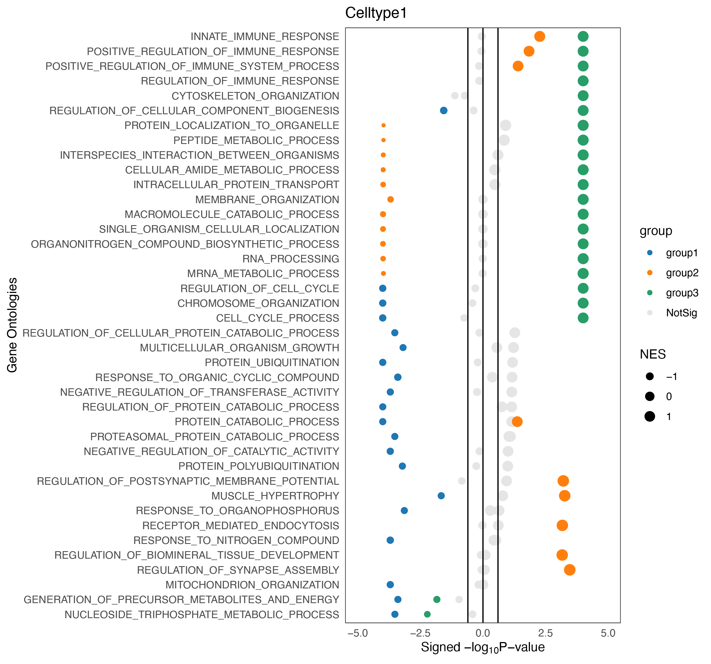

# ktplots
R plotting functions to plot gene expression data of single-cell data.


## Installation instructions
You can install the package via ```devtools::install_github()``` function in R
```R
library(devtools)
devtools::install_github('zktuong/ktplots', dependencies = TRUE)

# one function requires SummarizedExperiment from bioconductor
if (!requireNamespace("BiocManager", quietly = TRUE))
    install.packages("BiocManager")
BiocManager::install("SummarizedExperiment")
```
## Usage instructions
```R
library(ktplots)
```

### geneDotPlot
plotting gene expression dot plots heatmaps
```R
geneDotPlot(scdata = seurat_object, # object 
	idents = Idents(seurat_object), # a vector holding the cell-cluster ID/assignment or some other vector such as those found in the metadata seurat_object$split
	genes = c("CD68", "CD80", "CD86", "CD74", "CD2", "CD5"), # genes to plot
	split.by = "group", # column name in the meta data that you want to split the plotting by. If not provided, it will just plot according to idents
	save.plot = FALSE) # If TRUE, it will save to a location that you can specify via filepath and filename
```
hopefully you end up with something like this


### plot_cpdb
Generates the dot plot for cpdb output via specifying the cell types and the genes
```R
pvals <- read.delim("pvalues.txt", check.names = FALSE)
means <- read.delim("means.txt", check.names = FALSE) 
plot_cpdb(cell_type1 = "Bcell", # cell_type1 and cell_type2 will call grep, so this will accept regex arguments
	cell_type2 = "Tcell",
	means,
	pvals,
	groups = c("normal", "tumor"),
	genes = c("CXCL13", "CD274", "CXCR5"))
```

or, you can try by a crude grep via the 'gene.family'
```R
pvals <- read.delim("pvalues.txt", check.names = FALSE)
means <- read.delim("means.txt", check.names = FALSE) 
plot_cpdb(cell_type1 = "Bcell",
	cell_type2 = "Tcell",
	means,
	pvals,
	groups = c("normal", "tumor"),
	gene.family = "chemokines") # can also try Th1, Th2, Th17, Treg, costimulatory, coinhibitory, niche, 
```
example of what appears


### plotGSEA_Hallmark/plotGSEA_GO
Generates the dot plot for GSEA results

```R
plotGSEA_Hallmark(gsea_result, group_ref = "group3", cols = c("#1f77b4", "#ff7f0e", "#279e68"), newlabels = c("group1", "group2", "group3", "NotSig"))

plotGSEA_GO(gsea_result, top = 30, group_ref = "group3", cols = c("#1f77b4", "#ff7f0e", "#279e68"), newlabels = c("group1", "group2", "group3", "NotSig"))
```


#### example to prepare the table for plotting enrichment of hallmark signatures
```R
library(dplyr)
library(readr)
library(tibble)
library(pbmcapply)

# assuming the degs are in separate files to begin with
files <- as.list(list.files(pattern='.csv'))
degs <- lapply(files, read_csv)

library(kelvinny)
# read in gene set
h <- as.list(parse_gmt("h.all.v6.2.symbols.gmt")) # from kelvinny
h <- lapply(h, function(x) {x <- x[-1]; x <- x[!is.na(x)]; return(x)})

# do the symbol conversion
library(biomaRt)
mart <- useMart("ensembl", dataset="hsapiens_gene_ensembl")
m <- getBM(attributes=c("external_gene_name", "mmusculus_homolog_associated_gene_name"), mart=mart)

h <- lapply(h , function(x){
	y <- m$mmusculus_homolog_associated_gene_name[m$external_gene_name %in% x]
	y <- y[-which(y == "")]	
	return(y)
})

# filter the genes for the gsea?
up_cutOff = 1.5
down_cutOff = -1.5
geneList <- pbmclapply(degs, function(x){
	group1 <- x %>% dplyr::filter(!between(group1_logfoldchanges, up_cutOff, down_cutOff)) %>% dplyr::select(group1_gene, group1_logfoldchanges, group1_pvals)
	group2 <- x %>% dplyr::filter(!between(group2_logfoldchanges, up_cutOff, down_cutOff)) %>% dplyr::select(group2_gene, group2_logfoldchanges, group2_pvals)
	group3 <- x %>% dplyr::filter(!between(group3_logfoldchanges, up_cutOff, down_cutOff)) %>% dplyr::select(group3_gene, group3_logfoldchanges, group3_pvals)
	
	geneList_l <- list(group1 = group1, group2 = group2, group3 = group3)
	geneList_l <- pbmclapply(geneList_l, function(y) {
		y$neglog10pval <- -log10(y[,3, drop = TRUE])
		rank <- unlist(y$neglog10pval*sign(y[,2, drop = TRUE]))
		rank[which(rank == Inf)] <- -log10(10^-308)
		rank[which(rank == -Inf)] <- log10(10^-308)
		names(rank) <- y[,1, drop = TRUE]
		rank <- rev(sort(rank))
		# if there's are Inf values, just need to change those to -log10(10^-308) or inverse of that
		return(rank)
	}, mc.cores = 4)
	return(geneList_l)
}, mc.cores = 4)

library(fgsea)
result <- list()
for(i in 1:length(geneList)){
	result[[i]] <- lapply(geneList[[i]], function(x) fgsea(pathways = h, stats = x, nperm=10000, minSize = 0, maxSize = 1000))	
}

names(result) <- gsub('.csv', "",files)

for(i in 1:length(geneList)){
	result[[i]] <- lapply(result[[i]], function(x){
		x$ranking <- -log10(x$pval)*sign(x$NES)	
		x <- x[order(x$ranking), ]
		x[[1]]$group = "group1"
		x[[2]]$group = "group2"
		x[[3]]$group = "group3"
		return(x)
	})
}

result2 <- lapply(result, function(x) {
	y <- do.call(rbind, x)
	y$group <- factor(y$group, levels = c('group1', 'group2', 'group3')) 
	return(y)
})


for(i in 1:length(geneList)){
p <- plotGSEA_Hallmark(result2[[i]], group_ref = "group3", cols = c("#1f77b4", "#ff7f0e", "#279e68"), newlabels = c("group1", "group2", "group3", "NotSig")) + ggtitle(paste0(names(result3)[i]))
ggsave(paste0("./GSEA/plots/GSEA_Hallmarks", names(result3)[i],".pdf"), plot = p, w = 8.5)
}
```
example output #1


#### for enrichment of Gene Ontologies
```R
# read in gene set
c5 <- as.list(parse_gmt("c5.bp.v6.2.symbols.gmt")) # from kelvinny
c5 <- lapply(c5, function(x) {x <- x[-1]; x <- x[!is.na(x)]; return(x)})

# do the symbol conversion
c5 <- lapply(c5, function(x){
	y <- m$mmusculus_homolog_associated_gene_name[m$external_gene_name %in% x]
	y <- y[-which(y == "")]	
	return(y)
})

# do the GSEA
library(fgsea)
result <- list()
for(i in 1:length(geneList)){
	result[[i]] <- lapply(geneList[[i]], function(x) fgsea(pathways = c5, stats = x, nperm=10000, minSize = 0, maxSize = 1000))	
}

# some crude processing to generate the final table
names(result) <- gsub('.csv', "",files)
for(i in 1:length(geneList)){
result[[i]] <- lapply(result[[i]], function(x){
	x$ranking <- -log10(x$pval)*sign(x$NES)	
	x <- x[order(x$pathway), ]
	return(x)
})
}

# make the ranking of the last factor very big for plotting order
for(i in 1:length(geneList)){
	result[[i]][[3]]$ranking <- result[[i]][[3]]$ranking*999
}

# add in the grouping function
result <- lapply(result ,function(x){
	x[[1]]$group = "group1"
	x[[2]]$group = "group2"
	x[[3]]$group = "group3"
	return(x)
})

# trim the results to only those that show significance
sig <- list()
for(i in 1:length(geneList)){
	group1sig <- result[[i]][[1]]$pathway[which(result[[i]][[1]]$pval < 0.05 & result[[i]][[1]]$padj < 0.05)]
	group2sig <- result[[i]][[2]]$pathway[which(result[[i]][[2]]$pval < 0.05 & result[[i]][[2]]$padj < 0.05)]
	group3sig <- result[[i]][[3]]$pathway[which(result[[i]][[3]]$pval < 0.05 & result[[i]][[3]]$padj < 0.05)]
	sig[[i]] <- Reduce(union, list(group1sig, group2sig, group3sig))
}

result2 <- lapply(result, function(x) {
	x <- lapply(x, function(y) {
		y <- y[order(y$ranking), ]
		return(y)})
	z <- do.call(rbind, x)
	z$group <- factor(z$group, levels = c('group1', 'group2', 'group3')) 
	return(z)
})

result3 <- mapply(function(x,y){
	z <- x[x$pathway %in% y]
	return(z)
}, result2, sig, SIMPLIFY = FALSE)

# and finally to plot
for(i in 1:length(geneList)){
p <- plotGSEA_GO(result3[[i]], top = 30, group_ref = "group3", cols = c("#1f77b4", "#ff7f0e", "#279e68"), newlabels = c("group1", "group2", "group3", "NotSig")) + ggtitle(paste0(names(result3)[i]))
ggsave(paste0("./GSEA/plots/GSEA_GO_TOP30_", names(result3)[i],".pdf"), plot = p, w = 8.5)
}
```
example output #2

